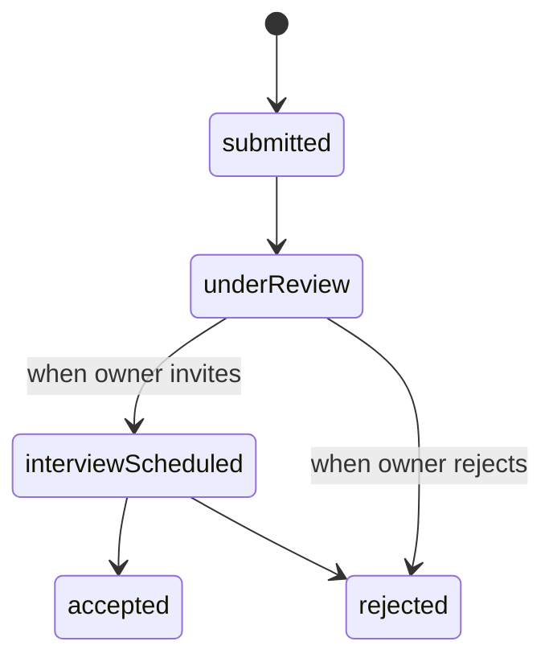

# application\_workflow\.spec.md

## Purpose

Specifies the detailed behaviors and UI flows for student application submissions, status lifecycle, and interview scheduling.

---

## Data Model: Application Status Lifecycle



---

## Screens & Components

1. **Apply Modal**

   * **Trigger**: “Apply” button on Opportunity card or details page
   * **Fields**:

     * Cover Note (required, textarea, max 500 chars)
     * Proof-of-Work URL (required, URL input)
   * **Actions**:

     * Submit → calls `POST /api/student/opportunities/{id}/apply`
     * Close modal without action

2. **My Applications Page** (`GET /student/applications`)

   * **List / Timeline** of student’s own applications
   * **Status Indicators**:

     * submitted (⏳)
     * underReview (🔍)
     * interviewScheduled (📅)
     * accepted (✅)
     * rejected (❌)
   * **Actions**:

     * If `interviewScheduled`: “View Meeting” (jumps to calendar invite)
     * If `submitted` or `underReview`: “Withdraw Application” (calls `DELETE /api/student/applications/{id}`)

3. **Interview Scheduling Component**

   * **Embed** owner’s available slots via Calendly or custom calendar picker
   * Student selects slot → `POST /api/student/applications/{id}/schedule`

4. **Status Updates Notifications**

   * In-app toast for: application received, status changed, interview scheduled, accepted/rejected
   * Email notification mirroring in-app events

---

## API Contracts

### 1. Submit Application

* **Route**: `POST /api/student/opportunities/{id}/apply`
* **Body**:

  ```json
  {
    "coverNote": "string",
    "proofOfWorkUrl": "string"
  }
  ```
* **Response**: `201 Created`

  ```json
  {
    "applicationId": "uuid",
    "status": "submitted",
    "submittedAt": "timestamp"
  }
  ```

### 2. Delete / Withdraw Application

* **Route**: `DELETE /api/student/applications/{id}`
* **Response**: `204 No Content`

### 3. Schedule Interview (Student Acceptance)

* **Route**: `POST /api/student/applications/{id}/schedule`
* **Body**:

  ```json
  {
    "meetingDateTime": "ISO-timestamp"
  }
  ```
* **Response**: `200 OK`

  ```json
  { "status": "interviewScheduled", "meetingLink": "url" }
  ```

---

## Error Handling & Validation

* **Client**: Validate non-empty coverNote, valid URL format
* **Server**: Return `400` for invalid input, `404` if opportunity not found, `409` if already applied
* **User Feedback**: Inline errors; disable submit button while processing

---

> *This spec primes the agent to scaffold the application modal, My Applications page, and scheduling integration without AI scoring.*
